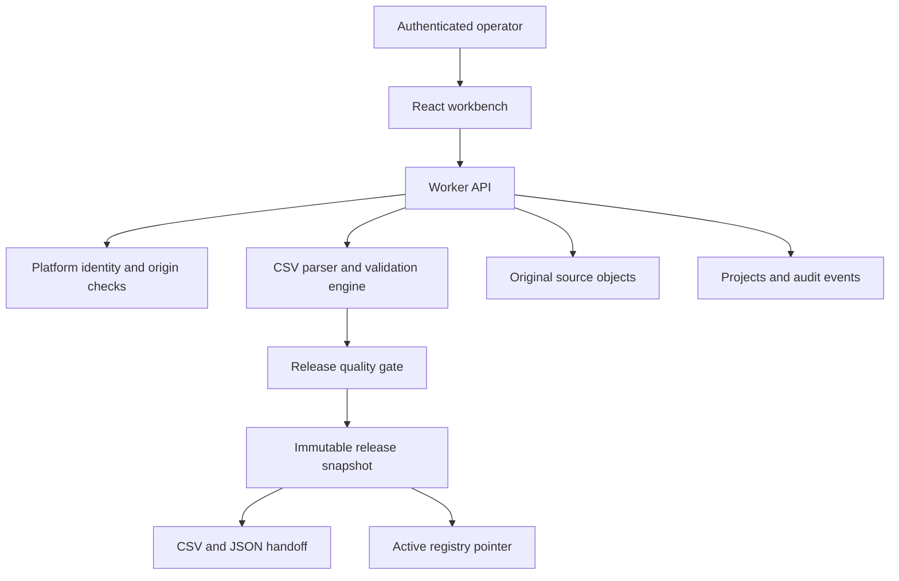

# Architecture and production boundaries

## System flow

## Authorization boundary

The application is published privately. The trusted Sites dispatcher authenticates the visitor and injects identity headers. The browser page requires sign in. Every API route calls the identity helper; all project, release, and audit access includes the authorized workspace ID. Membership is checked on every request. Raw source export first verifies access to the parent project.

Write requests must use JSON and a same origin Origin header. Client controls are convenience only. Validation and release eligibility are enforced again on the server.

The platform headers are trusted only behind the dispatcher. They are not signed application tokens and must not be trusted on a directly exposed Worker. Shared workspaces have owner, admin, operator, reviewer, and viewer roles. Optional independent approval binds the reviewer to the exact record checksum and contract version. Site audience access remains separate from application membership.

## Storage model

Projects use a JSON document for the bounded import aggregate, with separate indexed owner, revision, mutation ID, and update time columns. Source rows, mappings, exclusions, validation summaries, and the active release ID belong to this aggregate. The list endpoint strips row payloads and large validation arrays inside SQLite, avoiding bulk materialization of every dataset into Worker memory.

Releases are separate immutable rows with normalized records, row count, SHA256 checksum, operator note, timestamp, and previous active release ID. Audit events are separate append only rows in the application API. Routine editing cannot change historical snapshots or evidence. Explicit retention cleanup can permanently remove an expired trashed project and its related history.

Original CSVs live in R2. A unique object key is allocated for each import attempt. When a database insert fails, the attempt’s object is removed. A concurrent retry cannot remove the winning import’s source object. An interrupted process between object upload and database commit can still leave an orphaned object. The recovery console includes bounded orphan reconciliation; scheduled execution remains to be configured.

## Concurrency and idempotency

Project mutations carry the version last read by the client. The update predicate includes project ID, owner ID, and expected version. The operation assigns a unique mutation ID. Dependent audit and release inserts are conditional on that mutation ID and execute in the same atomic D1 batch. A losing concurrent request receives a conflict and creates no audit or release row.

Import requests carry a client generated UUID. Retrying a successful request with the same import fingerprint returns the existing deployment for that workspace; a changed payload is rejected. The client retains the UUID across request failures. This is import idempotency, not a general request replay system. An active snapshot cannot be published twice with identical normalized records.

## Validation and release semantics

Mapping is explicit and one to one. Alias suggestions do not claim to be AI inference. Every mapped source column must exist. Unknown plans, duplicate IDs, absent values, malformed email, invalid dates, and invalid revenue block release. Exclusions remove a row from the release set and require a recorded reason.

Any mapping change, row correction, exclusion, or restoration invalidates prior validation. Publication requires a current validation result and also reruns the deterministic engine. At least one valid record must remain, and no blocking row may remain.

The release checksum is SHA256 over the UTF8 JSON serialization of the ordered normalized records. It establishes content integrity, not a digital signature or proof of independent review. CSV export escapes quotes and neutralizes leading spreadsheet formula characters. JSON retains exact canonical values.

Rollback restores the previous release pointer. It retains all snapshots and leaves the working data available for correction. A separate working change flag prevents a newly validated working copy from being mislabeled as the active release.

## Intentional tradeoffs

A synchronous, bounded import is easier to reason about and demonstrate than an unreliable promise of millions of rows. The aggregate document makes atomic edits and consistent validation practical at this scale. A large production migration would require streamed input, chunked row storage, durable jobs, and checkpoints. The current bounded HTTPS adapter already provides retry budgets, idempotency keys, and receipt reconciliation; it still requires a real receiver.

The deterministic validator is the decision authority. An LLM would add value only for uncertain source interpretation, mapping proposals, or explanation. It should not invent missing business values or silently override release rules. An AI extension needs labeled mapping examples, evaluation, confidence thresholds, evidence, and human confirmation before it belongs in this workflow.

## Before expanding the service

The next development should follow a real pilot requirement. Live destination acceptance, external paging, scheduled backups and cleanup, hosted browser verification, external customer authentication, and billing remain open. See hardening.md for implemented controls and the precise verification boundaries. The framework uses a beta Vinext release and should be assessed before making a customer availability commitment.
